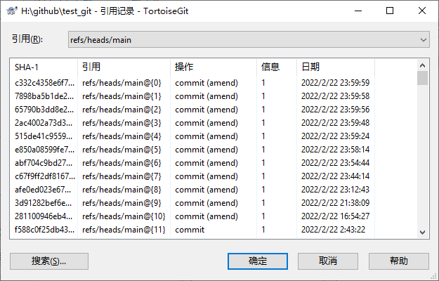

# 需求背景
有些时候希望按照规则的时间提交commit信息，比如强迫症可能希望每一次commit的时间都是整数时间、比如本地时间不准确，希望按照网络时间来提交[^1]、还有一些其他的原因。。

但是Git默认是按照本地的时间来提交commit信息，当然自由的Git有方法可以自定义提交的时间：

> SET GIT_COMMITTER_DATE=%C_TIME% && git commit --amend --no-edit --date=%A_TIME%

需要注意可以设定的时间分为`Author Date`和`Committer Date`[^2]。手动修改当然可以，但是每次修改岂不麻烦？要是有一次忘记了，后面还要`rebase`，那就麻烦大了。

久闻Git有的钩子（hook）功能，可以辅助完成各种自动化的操作，学习了一下钩子实现了自动切换commit到指定时间的方法。

# 客户端Hooks
Git的客户端钩子只影响它们所在的本地仓库。客户端挂钩主要分为几种类型[^3]：提交工作流挂钩、电子邮件工作流挂钩、以及其他客户端挂钩。

## 提交工作流挂钩
`commit`操作有4个挂钩被用来处理提交的过程，它他们的触发时间顺序如下：
`pre-commit`、`prepare-commit-msg`、`commit-msg`、`post-commit`。

## post-commit
`post-commit` 挂钩在整个提交过程完成后运行，它不会接收任何参数，但可以很简单地运行`git log`来获得最后的提交信息。

打开`~\.git\hooks`目录，创建`post-commit`文件（注意没有后缀名），内容如下：

```python
#!/usr/bin/env python

import os
import time

popen = lambda cmd: os.popen(cmd).read()
show = lambda stamp: time.strftime('%Y-%m-%d %H:%M:%S %a', time.localtime(stamp)) if stamp else 'None'

def convert(stamp):
    day = time.localtime(stamp)
    wday = day.tm_wday
    monday = time.mktime(day[:3] + (0,) * 6) - 86400 * wday
    if wday < 5:
        return monday + 86400 * 5 + (stamp - monday) * 0.4

def amend(at=None, ct=None):
    cmd_ct = 'set GIT_COMMITTER_DATE=%s && ' % ct if ct else ''
    cmd_at = ' --date=%s' % at if at else ''
    cmd = cmd_ct + 'git commit --amend --no-edit' + cmd_at if (at or ct) else ''
    return cmd

at1 = int(popen('git log -1 HEAD --format=%at'))
ct1 = int(popen('git log -1 HEAD --format=%ct'))
at2 = convert(at1)
ct2 = convert(ct1)
cmd = amend(at2, ct2)

print('at:', show(at1), '->', show(at2))
print('ct:', show(ct1), '->', show(ct2))
print(cmd)
print(popen(cmd))
```

一个简单的脚本实现`commit`之后，根据`git log`获取最后一次提交时间，在`convert`函数中对时间戳进行转换，然后再次提交一次`commit --amend`，修改最后一次提交的时间。

本例中将周一到周五的时间映射到了周末，这样所有工作日的提交就会自动变更记录为周末的提交时间（注意如果遇到节假日的调班就不行了哦）。

提供一个测试方法，测试这些函数是否正常运行：

```python
def test():
    print('\ntime offset test:')
    p1 = time.mktime(time.strptime('2000-01-01', '%Y-%m-%d'))
    p2 = time.mktime(time.strptime('2012-12-21', '%Y-%m-%d'))
    print(show(p1), '->', show(convert(p1)))
    print(show(p2), '->', show(convert(p2)))

    print('\namend cmd test:')
    print(amend())
    print(amend(at='%A_TIME%'))
    print(amend(ct='%C_TIME%'))
    print(amend('%A_TIME%', '%C_TIME%'))

    print('\ntest finish.\n')
```

# 注意事项
1、修改提交时间的本质是在`commit`命令之后再次运行一次`commit --amend`，所以在引用记录里仍然能够看到所有的操作。如果有方法能够将这一步也能避免，这是值得改进的；

2、`commit --amend`本身实际上也是一次`commit`，所以在这次`commit`之后会再次触发`post-commit`挂钩。所以需要设计合理的逻辑让`amend`之后的提交不再符合`post-commit`脚本里的规则，不会再次进行`commit --amend`提交，否则可能产生递归。当然，除非递归本身就是你预期的效果。



[^1]: [基于Python开发pre-commit hook达到对Git提交时间的控制](https://blog.csdn.net/rowanhaoa/article/details/52818637)
[^2]: [为什么git AuthorDate与CommitDate不同？](https://cloud.tencent.com/developer/ask/85185)
[^3]: [GitHook工具介绍及使用](https://www.cnblogs.com/jiaoshou/p/12222665.html) 

------

From: https://blog.csdn.net/weixin_39804265/article/details/123073491

